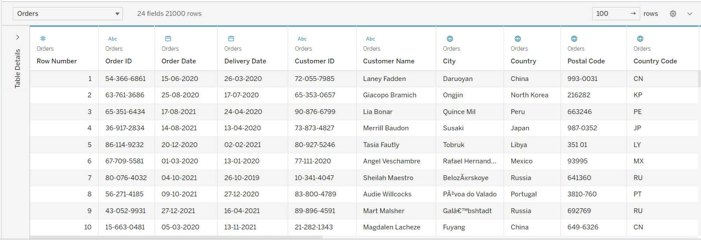

## Database Engineer Capstone

Related skills:
- [MySQL][0]
- MySQL Workbench
- [Tableau - Business Intelligence and Analytics Software][1]
- Python

This project belongs to [Meta Database Engineer Specialization][2]

## Tableau Demo

### Little Lemon Data

- Data Source Page

- Cuisine Sales and Profits

### Global Supper Store Data

- USA Sales Map

- Sales Trend in USA

- USA Profit Bubble Chart

[0]: https://www.mysql.com/
[1]: https://www.tableau.com/
[2]: https://www.coursera.org/professional-certificates/meta-database-engineer?